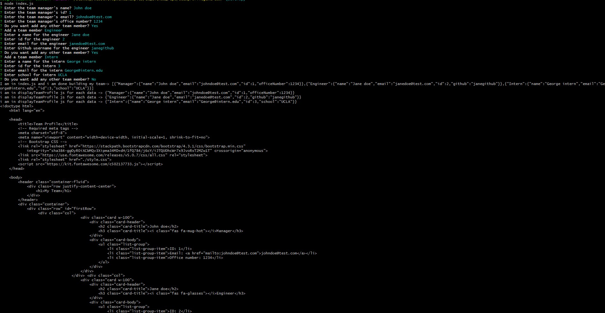
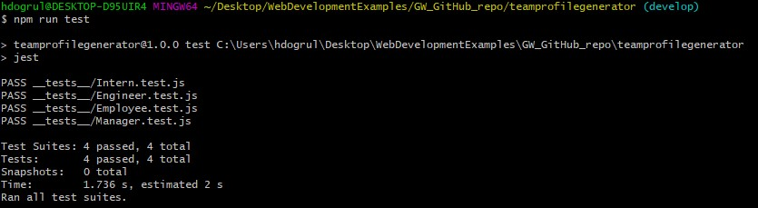

# Team Profile Generator

  ## Description

  This is the project for the week 10
  
  ## Table of Contents
  
  
  * [Installation](#installation)
  * [Usage](#usage)
  
  
  ## Installation

  - Please navigate to project folder and open Terminal/Gitbash, run npm install to retrieve the necessary libraries, and Run the following node index.js
  - After user answers the questions, the application will create a file under "dist" file called called MyTeam-AutoGenerated.html

  
  ## Usage 

  AS A manager
  I WANT to generate a webpage that displays my team's basic info
  SO THAT I have quick access to their emails and GitHub profiles

  ## Tools

  Tools are used Javascript, Node, HTML, CSS

  ## Screenshots & Additional Info

  
  
  
  The demo can be found: 
  The URL to the repo: https://github.com/hikod/teamprofilegenerator

  ## Questions 
    
  https://github.com/hikod

  Please email me for further questions at hikmetdogrul00@gmail.com